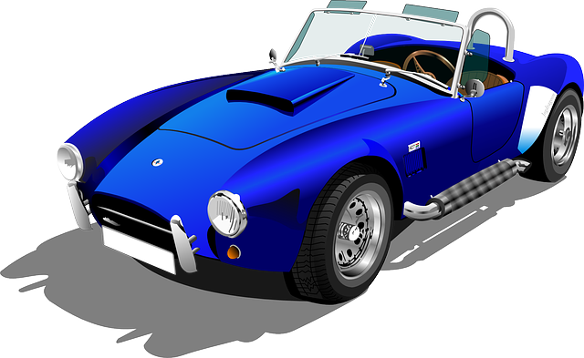

# Título de las diapositivas

---
<!-- Esta página usa fondo aqua con letras negras, el guión bajo especifica que es una directiva local -->
<!-- paginate: true -->
<!-- 
_backgroundColor : aqua 
_color: black
-->

This page has aqua background.

---
<!-- backgroundColor: white -->
---

The second page also has same color.
    * punto 1
    * punto 2

---

<!-- backgroundColor: orange -->
# Página de color naranja

---
<!-- _color: white -->

# Página con letras blancas

---

<!-- _backgroundImage: "linear-gradient(to bottom, #9FF073, #0288d1)" -->

Fondo con color gradual

A = 10 B C D E F = 15

---

<!--
_backgroundColor: black
_color: white
-->

Fondo con color gradual y letras blancas

---

 
<!-- header: ' '  -->
<!-- footer: ' '  -->

Aquí

---

 <!-- Setting width to 200px -->

---

 <!-- Setting height to 300px -->

---

 <!-- Setting both lengths -->

---

 <!-- Setting both lengths -->

---
<!-- _backgroundColor: white -->

 <!-- Setting both lengths -->
 <!-- difuminar -->
 <!-- brillo -->
 <!-- contraste -->

 <!-- sombra -->

 <!-- derecha - escala de grises -->

---

<!-- backgroundColor: lightblue -->

# Fondos divididos

El espacio de la diapositiva se encogerá a la derecha.

* La imagen corresponde a una [página externa](https://picsum.photos/720?image=29 'link').

---

# Fondos divididos 2

El espacio de la diapositiva se encogerá a la izquierda.

* La imagen corresponde a una [página externa](https://picsum.photos/720?image=29 'link').

---

<!-- _backgroundColor: lightgrey -->

# Fondos divididos con tamaño específico

---

# Color hexadecimal (Fondo blanco + Texto negro)

---

# color nombrado (rebeccapurple BG + texto blanco)

---

# RGB values (Fondo Orange + Texto White)

)
)

---

<!-- 
_backgroundColor: rgb(255,128,0)
_color: rgb(0,0,0)
-->

# valor RGB utilizando directivas  (Fondo Orange + Texto Black)

---
